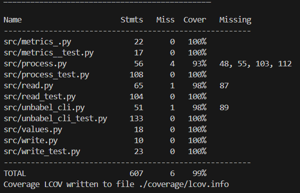

# Unbabel Backend Engineering Challenge - Solution

This repository presents a simple command line application that parses a stream of events and produces an aggregated output. It calculates metrics (moving average or maximum) of translation delivery times for the last X minutes, updated every minute.


## Installation

Clone the repository

```shell
git clone https://github.com/PedroMariaRodrigues/backend-engineering-challenge.git

cd backend-engineering-challenge
```

### Installation via [`setup.py`](setup.py)

To install the application from source

```shell
pip install .
```

For development mode (changes to code take effect without reinstallation):

```shell
pip install -e .
```

## Docker Installation

```shell
docker run -it -v .:/code python:3.11 bash
cd code
make
```

## Usage

Run the CLI tool on your event data:
```shell
unbabel_cli --input_file <INPUT_FILE> --window_size <WINDOW_SIZE> [OPTIONS]
```
### Parameters

- `--input_file`: Path to the JSON file containing the events
- `--window_size`: Size of the moving window in minutes
- `--metric`(Optional): Choose the metric to analyze the data 
	- `moving_average`(default): Calculate moving average of delivery times
	- `maximum`: Calculate maximum delivery time
- `--output`(Optional): Path to the output file (defaults to "output.json"), or can use "cli" to print in terminal
- `--keep_live`(Optional): After reading all the input file, keeps reading the file for new events


### Example Commands

Basic usage with moving average:

```python
unbabel_cli --input_file example.json --window_size 10
```

Use maximum metric and outputting to console:
```python
unbabel_cli --input_file example.json --window_size 5 --metric maximum --output cli
```

Monitor live file updates:
```python
unbabel_cli --input_file example.json --window_size 10 --keep_live
```

# Project Structure
- [`test.yml`](.github/workflows/test.yml): GitHub Actions workflow for CI/CD
- [`unbabel_cli.py`](src/unbabel_cli.py): Entry point to the application
- [`values.py`](src/values.py): Event data model and result formatting
- [`metrics_.py`](src/metrics_.py): Metric calculation implementations
- [`process.py`](src/process.py): Core processing logic for events
- [`read.py`](src/read.py): Input handling and file monitoring
- [`write.py`](src/write.py): Output handling (file or CLI)
- [`example.json`](example.json): JSON file with example events
- [`setup.py`](setup.py): Configuration file for packaging the application
- `*_test.py`: Test files for each module

# Event Format

```json
{
	"timestamp": "2018-12-26 18:12:19.903159",
	"translation_id": "5aa5b2f39f7254a75aa4",
	"source_language": "en",
	"target_language": "fr",
	"client_name": "airliberty",
	"event_name": "translation_delivered",
	"duration": 20,
	"nr_words": 100
}
```

## Output Format
### For Moving Average:
```json
{"date": "2018-12-26 18:12:00", "average_delivery_time": 15.5}
``` 

### For Maximum:
```json
{"date": "2018-12-26 18:12:00", "max_delivery_time": 35}
```

# Assumptions

- Events are ordered by timestamp
- Time window is specified in minutes

# Testing

The project includes comprehensive unit and integration tests with high code coverage.

## Running tests

Using pytest directly:

```shell
python -m venv .venv
.venv/Scripts/Activate.ps1 #On Windows
source .venv/bin/activate  #On Linux/Mac 
pip install -r requirements.txt
pytest
```    

## In Docker:

Using Make:
```shell
docker run -it -v .:/code python:3.11 bash
cd code
make test
```

For tests with coverage report:
```shell
make test-coverage
```

# Error Handling Examples
The application handles various error cases:

1. Missing or Invalid input file
```shell
FileNotFoundError: The file 'nonexistent_file.json' does not exist.
```
2. Invalid Window Size:
```shell
ValueError: The window size must be a positive integer.
```

3. Invalid metric name:
```shell
SystemExit: 2  # with argparse error message
```

4. Malformed JSON in input file:
```shell
Error decoding JSON: {bad json}
```

5. Missing required fields in event:
```shell
Error decoding JSON: { "timestamp": "2025-04-20T12:00:00Z", "duration": }
```

# CI Workflow
The project uses GitHub Actions for continuous integration. The workflow in [`test.yml`](.github/workflows/test.yml) automatically:

1. Sets up Python 3.11
2. Installs dependencies using `make install-requirements`
3. Runs tests with coverage using `make test-coverage`
4. Generates coverage reports

The workflow is triggered on:

 - All pushes to any branch
 - Pull requests to the master branch

# Test Coverage
The project has comprehensive test coverage as demonstrated by the coverage reports. To view the coverage report:

```shell
make test-coverage
```

This generates:

- Terminal report with line-by-line coverage metrics
- LCOV report at lcov.info

Current code coverage is close to 100% across all modules, ensuring reliability and stability.




# Extra Features

## Additional Metrics
The framework is designed to be extensible with different metrics. Currently implemented:

- `moving_average`: Calculates average delivery time over the window period
- `maximum`: Finds maximum delivery time in the window period

## Live File Monitoring

With the `--keep_live` option, the application can monitor a file for new events in real-time, which is useful for ongoing data streams.

## Event Generator

It's possible to generate test events (random timestamp and duration) using the event generator:

```shell
python event_generator.py --output_file events.json --max_delay 10
```

### Parameters

- `--output_file`: Path to the output file (the input file used for unbabel_cli)
- `--max_delay`(Optional):  Maximum delay between random generated timestamp events

# For Production Use:
The following features are necessary for production use but have not been implemented yet:

- Logging for observability to monitor application behavior and diagnose issues.
- Code structure improvements to organize the application into modular pages.
